# ⚡ PulseCart — E-Commerce Funnel Optimization & Retention Infrastructure

<div align="center">

[](https://kedro.org/)
[](https://cloud.google.com/bigquery)
[](https://www.getdbt.com/)
[](https://python.org)
[](https://powerbi.microsoft.com/)
[](https://docs.getdbt.com/docs/build/data-tests)
[](https://docs.pytest.org/)

**Production-grade Analytics Engineering, Experimentation, and Cohort Retention Infrastructure**  
*Analyzing 100,000+ customer sessions across Google BigQuery, dbt Core, Kedro, and Power BI.*

[Key Metrics](#-key-empirical-highlights) •
[Architecture](#-system-architecture) •
[Kedro Pipeline](#-kedro-pipeline-architecture) •
[dbt Modeling](#-dbt-data-warehouse-modeling) •
[A/B Testing](#-statistical-ab-testing--experimentation) •
[Power BI Dashboard](#-power-bi-executive-dashboard) •
[Quickstart](#-quickstart--execution-guide) •
[Interview Q&A](#-technical-interview-guide)

</div>

---

## 📌 Executive Summary

**PulseCart** is an end-to-end, production-style analytics engineering and statistical experimentation platform built for high-volume modern e-commerce. It addresses a fundamental e-commerce business bottleneck: **rising Customer Acquisition Costs (CAC) coupled with undetected checkout friction and cohort churn.**

Rather than presenting fabricated metrics or disconnected SQL snippets, PulseCart operates as a unified, reproducible pipeline:
1. **Raw Event Streaming**: Ingests **100,000 sessions** (30,000 users, 230,199 events, 10,022 orders) with realistic relational integrity.
2. **dbt Warehouse Layer**: Transforms raw payloads through a 4-layer Kimball architecture (`staging`, `intermediate`, `marts`) on BigQuery SQL with **174 automated schema tests**.
3. **Kedro Master Orchestration**: Wraps warehouse ELT and scientific Python processing into modular DAG nodes backed by a declarative **Data Catalog** (`catalog.yml`) and centralized parameters (`parameters*.yml`).
4. **Statistical Experimentation Engine**: Evaluates a randomized checkout A/B test via **Sample Ratio Mismatch (SRM)** $\chi^2$ testing, **Two-Proportion Z-Test**, and **Delta Method 95% Confidence Intervals** with zero data manipulation.
5. **Executive BI & DAX**: Delivers an interactive 4-page Power BI dashboard driven by **74 production DAX measures** and an in-memory VertiPaq Star Schema.

---

## 📊 Key Empirical Highlights

All metrics below are computed strictly from the empirical 100,000-session dataset via executable Python and dbt/SQL pipelines:

| Metric Category | Production Value | Verification & Method |
| :--- | :--- | :--- |
| **Analyzed Session Volume** | **100,000 sessions** | 30,000 users • 230,199 events • 10,022 completed transactions |
| **Top-to-Bottom Conversion** | **10.02%** | Landing Page (100K) $\rightarrow$ Purchase (10,022 orders) |
| **Primary Funnel Leakage** | **38.01% drop** (Product View) & **52.29% drop** (Cart) | Add-to-Cart step presents the highest relative customer drop-off |
| **A/B Test Relative Lift** | **+8.45%** ($p = 8.42 \times 10^{-11}$) | Control: 58.51% $\rightarrow$ Treatment: 63.45% (+4.94 pp absolute) |
| **Statistical Test Statistic** | **$Z = 6.4929$** | Two-Proportion Z-Test against $H_0: p_t = p_c$ ($p \ll 0.0001$) |
| **95% Confidence Interval** | **[+5.90%, +10.99%]** | Delta Method relative lift 95% CI bounds |
| **Sample Ratio Mismatch (SRM)**| **$\chi^2 = 0.9972$ ($p = 0.3180$)** | Pearson Goodness-of-Fit test confirms allocation balance ($\alpha = 0.01$) |
| **Annualized Gross Revenue Lift**| **+$591,911 ARR** | Based on 100K annual checkouts, \$119.82 AOV, and 52% gross margin |
| **Repeat Purchase Rate** | **28.42%** | 2,001 repeat buyers out of 7,042 purchasing users across 12 cohorts |
| **Automated Test Coverage** | **174 dbt tests + 110 unit tests** | 100% pass rate covering uniqueness, referential integrity & statistical invariants |

---

## 🏗️ System Architecture

PulseCart bridges in-warehouse ELT with Python scientific computing using Kedro as the central orchestrator:

```mermaid
flowchart TD
    subgraph INGESTION ["1. Ingestion Layer (data/raw/)"]
        raw_u[(raw_users: 30K)]
        raw_s[(raw_sessions: 100K)]
        raw_e[(raw_events: 230K)]
        raw_o[(raw_orders: 10K)]
        raw_oi[(raw_order_items: 14K)]
        raw_p[(raw_products: 100)]
    end

    subgraph KEDRO_CATALOG ["2. Kedro Data Catalog (conf/base/catalog.yml)"]
        catalog_raw["Raw Dataset Connectors (Parquet/CSV/BigQuery)"]
        catalog_marts["Production Mart Connectors"]
        catalog_rep["Statistical Report Deliverables (JSON)"]
    end

    subgraph DBT_LAYER ["3. dbt Core Transformation Engine (dbt_pulsecart/)"]
        direction TB
        subgraph STG ["Staging Layer (6 SQL Views)"]
            stg_users
            stg_sessions
            stg_events
            stg_orders
            stg_order_items
            stg_products
        end
        subgraph INT ["Intermediate Layer (5 SQL Views)"]
            int_session_funnel_events
            int_order_items_aggregated
            int_user_order_summary
            int_user_cohort_monthly
            int_ab_session_conversions
        end
        subgraph MARTS ["Consumption Marts (Kimball Star Schema)"]
            dim_date
            dim_products
            dim_users
            fct_funnel
            fct_orders
            fct_user_retention
            fct_ab_test
        end
        STG --> INT --> MARTS
    end

    subgraph DQ_CIRCUIT ["4. Data Quality Gate & Circuit Breaker"]
        dbt_tests["174 dbt Schema & Referential Assertions"]
    end

    subgraph STATS_LAYER ["5. Scientific Analytics Engine (src/analytics/)"]
        funnel_node["Multi-Stage Funnel Analyzer"]
        retention_node["Monthly Cohort Retention & LTV Engine"]
        ab_test_node["Two-Proportion Z-Test & SRM Validator"]
    end

    subgraph BI_CONSUMPTION ["6. Executive Delivery & BI (power_bi/)"]
        pbi_refresh["Power BI REST API Refresh Trigger"]
        pbi_model["VertiPaq Semantic Model (74 DAX Measures)"]
        pbi_dash["4-Page Executive Power BI Dashboard"]
    end

    INGESTION --> catalog_raw
    catalog_raw --> DBT_LAYER
    MARTS --> DQ_CIRCUIT
    DQ_CIRCUIT -->|174 Tests PASS| catalog_marts
    catalog_marts --> STATS_LAYER
    STATS_LAYER --> catalog_rep
    catalog_rep --> BI_CONSUMPTION
```



---

## ⚙️ Kedro Pipeline Architecture

The project adheres strictly to the official **Kedro enterprise project structure**. It wraps existing BigQuery/dbt transformations as Kedro nodes with zero modification to SQL logic.

### 1. Project Directory Layout
```text
pulsecart/
├── conf/
│   ├── base/
│   │   ├── catalog.yml               # Declarative Data Catalog (Raw, Marts, Reports)
│   │   ├── parameters.yml            # Global pipeline parameters (Power BI settings)
│   │   ├── parameters_analytics.yml  # A/B significance (alpha=0.05), SRM threshold, cohort windows
│   │   └── parameters_dbt.yml        # dbt execution profiles and selectors
│   └── local/
│       └── credentials.yml           # Local credentials & BigQuery auth (gitignored)
├── pyproject.toml                    # Official Kedro project metadata (package: pulsecart)
├── src/
│   └── pulsecart/                    # Kedro project package
│       ├── __init__.py
│       ├── __main__.py               # CLI runner: python -m pulsecart
│       ├── settings.py               # OmegaConfigLoader & hook configuration
│       ├── pipeline_registry.py      # Modular sub-pipeline discovery
│       └── pipelines/
│           ├── dbt_transforms/       # Wraps dbt models as Kedro nodes
│           │   ├── nodes.py          # validate_raw, materialize_dbt, run_tests
│           │   └── pipeline.py
│           ├── statistical_analytics/ # Scientific Python nodes (SciPy / Pandas)
│           │   ├── nodes.py          # Pure analytical functions
│           │   └── pipeline.py
│           └── reporting/            # Deliverable aggregation & BI refresh
│               ├── nodes.py          # Master summary synthesizer & Power BI trigger
│               └── pipeline.py
├── dbt_pulsecart/                    # Existing intact dbt SQL project
├── data/                             # Data directory (raw/, marts/)
├── reports/                          # Generated statistical JSON artifacts
└── tests/                            # 110 passing unit & regression tests
```

### 2. Modular Pipeline Registry

Kedro's Pipeline Registry (`src/pulsecart/pipeline_registry.py`) exposes modular sub-pipelines for targeted execution:

| Pipeline Name | Nodes Included | Inputs / Outputs | CLI Command |
| :--- | :--- | :--- | :--- |
| **`dbt_pipeline`** | `validate_raw_sources`<br>`materialize_dbt_models`<br>`run_dbt_schema_tests` | Reads raw catalog datasets $\rightarrow$ materializes 18 models $\rightarrow$ executes 174 tests. | `kedro run --pipelines dbt_pipeline` |
| **`analytics_pipeline`** | `compute_funnel_analytics`<br>`compute_cohort_retention`<br>`evaluate_ab_experiment` | Ingests `fct_funnel`, `fct_orders`, `fct_user_retention`, `fct_ab_test` $\rightarrow$ outputs 3 JSON reports. | `kedro run --pipelines analytics_pipeline` |
| **`reporting_pipeline`** | `generate_executive_summary`<br>`trigger_power_bi_refresh` | Consolidates reports into `statistical_summary.json` $\rightarrow$ triggers Power BI REST API refresh. | `kedro run --pipelines reporting_pipeline` |
| **`__default__`** | All 8 Nodes | Complete end-to-end execution from raw landing to dashboard refresh. | `kedro run` or `python -m pulsecart` |

### 3. Declarative Data Catalog (`catalog.yml`)

The Data Catalog isolates storage details from computational logic. Switching from local DuckDB Parquet to Google BigQuery in staging requires changing one YAML parameter:

```yaml
# Local Execution (Default)
fct_ab_test:
  type: kedro_datasets.pandas.ParquetDataset
  filepath: data/marts/fct_ab_test.parquet

# Enterprise Cloud BigQuery (Swap without code changes)
# fct_ab_test:
#   type: kedro_datasets.pandas.GBQTableDataset
#   dataset: pulsecart_marts.fct_ab_test
#   project: pulsecart-production-gcp
```

---

## 🗄️ dbt Data Warehouse Modeling

The warehouse layer organizes 18 SQL models into a production Kimball Star Schema with strict typing, Jinja templating, and incremental merge strategies.

### 1. Layer-by-Layer Progression
```
Raw Source Data (6 tables)
       │
       ▼
Staging Layer (6 Views: stg_users, stg_sessions, stg_events, stg_orders, stg_order_items, stg_products)
       │
       ▼
Intermediate Layer (5 Views: int_session_funnel_events, int_order_items_aggregated, int_user_order_summary, int_user_cohort_monthly, int_ab_session_conversions)
       │
       ▼
Marts Layer (7 Tables: dim_date, dim_products, dim_users, fct_funnel, fct_orders, fct_user_retention, fct_ab_test)
       │
       ▼
Data Quality Gate (174 dbt schema & referential tests: 0 failures)
```

### 2. Kimball Dimensional Star Schema

```
                  ┌──────────────────────┐
                  │       dim_date       │
                  └──────────┬───────────┘
                             │ (1:*)
       ┌──────────────────────┼──────────────────────┐
       │ (1:*)                │ (1:*)                │ (1:*)
┌─────▼──────┐        ┌──────▼─────┐        ┌───────▼──────┐
│ fct_funnel │        │ fct_orders │        │ fct_ab_test  │
└─────▲──────┘        └──────▲─────┘        └───────▲──────┘
      │                      │                      │
      │ (1:*)                │ (1:*)                │ (1:*)
      ├──────────────────────┴──────────────────────┤
      │                                             │
┌─────┴──────┐                                ┌─────┴──────────────┐
│ dim_users  │◄───────────────────────────────┤ fct_user_retention │
└─────┬──────┘              (1:*)             └────────────────────┘
      │
      │ (1:*)
┌─────▼────────┐
│ dim_products │
└──────────────┘
```

### 3. Incremental Merge Strategy & Partitioning

To optimize BigQuery compute and control query costs, high-volume event tables (`fct_funnel`, `fct_orders`) employ dbt's `incremental` merge strategy with a **3-day late-arriving lookback window**:

```sql
{{
  config(
    materialized = 'incremental',
    unique_key = 'session_id',
    partition_by = {'field': 'session_date', 'data_type': 'date', 'granularity': 'day'},
    cluster_by = ['device_type', 'country', 'traffic_source', 'ab_variant']
  )
}}

WITH sessions AS (
    SELECT * FROM {{ ref('stg_sessions') }}
    
      WHERE session_start >= (
          SELECT TIMESTAMP_SUB(MAX(session_start), INTERVAL 3 DAY) FROM {{ this }}
      )
    
)
...
```
* **Partition Pruning:** Scans only the last 72 hours of data instead of full table history, reducing daily cloud compute costs by **>90%**.
* **Atomic Merge Idempotency:** The `unique_key = 'session_id'` clause executes an atomic `MERGE INTO`, preventing duplicate records during backfills.

---

## 🔬 Statistical A/B Testing & Experimentation

The checkout optimization experiment evaluated a **Simplified 1-Page Checkout (Treatment)** against the existing **Multi-Step Checkout (Control)** across 16,430 checkout sessions.

### 1. Empirical Results Table

All calculations below are verified empirically by `python/ab_test_analysis.py` and `src/analytics/ab_test.py`:

| Parameter / Metric | Control Group | Treatment Group | Difference / Impact | Statistical Evaluation |
| :--- | :--- | :--- | :--- | :--- |
| **Participants ($N$)** | 8,151 sessions (49.61%) | 8,279 sessions (50.39%) | Total: 16,430 sessions | $\chi^2 = 0.9972$, $p = 0.3180$ (**SRM PASSED**) |
| **Conversions ($X$)** | 4,769 completed orders | 5,253 completed orders | **+484 incremental orders** | — |
| **Conversion Rate ($p$)** | **58.51%** | **63.45%** | **+4.94% pts absolute** | $95\%\text{ CI: }[+3.45\%, +6.43\%]$ |
| **Relative Conversion Lift** | Baseline | **+8.45%** | **+8.45% relative lift** | $95\%\text{ CI: }[+5.90\%, +10.99\%]$ |
| **Pooled Standard Error** | — | — | **$SE_{\text{pool}} = 0.00761$** | — |
| **Test Statistic ($Z$)** | — | — | **$Z = 6.4929$** | Critical $|Z| \ge 1.96$ exceeded |
| **p-value (Two-Sided)** | — | — | **$p = 8.42 \times 10^{-11}$** | **$p \ll 0.0001$ (Statistically Significant)** |
| **Executive Decision** | — | — | **DEPLOY TREATMENT** | 100% rollout recommended |

### 2. Mathematical Rigor & Formulas

#### Sample Ratio Mismatch (SRM) Balance Check:
$$\chi^2 = \sum_{i \in \{c, t\}} \frac{(O_i - E_i)^2}{E_i} = \frac{(8151 - 8215)^2}{8215} + \frac{(8279 - 8215)^2}{8215} = 0.9972$$
At $\alpha = 0.01$ ($df = 1$, critical value $6.635$), $p = 0.3180 > 0.01$. The null hypothesis of balanced 50/50 allocation cannot be rejected, confirming **no assignment bias**.

#### Two-Proportion Hypothesis Test ($H_0: p_t = p_c$ vs. $H_1: p_t \ne p_c$):
$$Z = \frac{\hat{p}_t - \hat{p}_c}{\sqrt{\hat{p}_{\text{pool}}(1 - \hat{p}_{\text{pool}})\left(\frac{1}{N_c} + \frac{1}{N_t}\right)}} = \frac{0.6345 - 0.5851}{0.00761} = \mathbf{6.4929}$$

#### Delta Method Relative Lift 95% Confidence Interval:
$$\text{Relative Lift} = \frac{\hat{p}_t - \hat{p}_c}{\hat{p}_c} = \mathbf{+8.45\%} \quad \left(95\%\text{ CI: } [+5.90\%, +10.99\%]\right)$$

### 3. Subgroup Dimensional Performance

```
Device Type Lift Breakdown:
  ├── Desktop : Control 63.55% ──► Treatment 68.59% (+7.93% lift, p = 1.19e-06)
  ├── Mobile  : Control 52.59% ──► Treatment 57.57% (+9.47% lift, p = 4.76e-05)  <-- Highest absolute impact
  └── Tablet  : Control 55.95% ──► Treatment 61.37% (+9.69% lift, p = 0.033)
```

---

## 📈 Funnel Progression & Cohort Retention

### 1. Behavioral Funnel Leakage
```
[Step 1] Landing Page   : 100,000 sessions (100.0%)
            │
            └── 38.01% drop-off
[Step 2] Product View   :  61,993 sessions ( 61.99% step conv)
            │
            └── 52.29% drop-off  ◄── HIGHEST RELATIVE FRICTION POINT
[Step 3] Add to Cart    :  29,574 sessions ( 47.71% step conv)
            │
            └── 44.44% drop-off
[Step 4] Checkout Start :  16,430 sessions ( 55.56% step conv)
            │
            └── 25.87% drop-off
[Step 5] Payment Start  :  12,180 sessions ( 74.13% step conv)
            │
            └── 17.72% drop-off
[Step 6] Purchase Done  :  10,022 orders   ( 82.28% step conv)
─────────────────────────────────────────────────────────────
OVERALL TOP-TO-BOTTOM CONVERSION RATE: 10.02%
```

### 2. Monthly Cohort Retention Matrix (M0–M6 Sample)

| Cohort Month | M0 | M1 | M2 | M3 | M4 | M5 | M6 |
| :--- | :---: | :---: | :---: | :---: | :---: | :---: | :---: |
| **2024-01** | **100.0%** | 25.4% | 18.2% | 14.1% | 11.9% | 10.2% | 9.1% |
| **2024-02** | **100.0%** | 24.8% | 17.9% | 13.8% | 11.5% | 9.8% | -- |
| **2024-03** | **100.0%** | 24.1% | 17.2% | 13.4% | 11.1% | -- | -- |
| **2024-04** | **100.0%** | 25.0% | 18.1% | 14.0% | -- | -- | -- |
| **2024-05** | **100.0%** | 24.6% | 17.5% | -- | -- | -- | -- |
| **2024-06** | **100.0%** | 25.2% | -- | -- | -- | -- | -- |

* **Retention Invariant Verification**: Month 0 is strictly **100.0%** across all 12 cohorts with verified monotonic decay.
* **Repeat Purchase Rate**: **28.42%** of purchasing customers placed $\ge 2$ orders.
* **VIP Customer Value**: VIP segment exhibits **45.93% repeat purchase rate** with \$348.50 average LTV compared to \$92.10 for Bargain shoppers.

---

## 💰 Annualized Financial Impact Model

Modeling the rollout of the Treatment checkout variant across an annual baseline of **100,000 checkout sessions** (\$119.82 AOV, 52.0% gross margin):

$$\text{Incremental Annual Orders} = 100,000 \times (0.6345 - 0.5851) = \mathbf{+4,940\text{ orders}}$$
$$\text{Incremental Annual Gross Revenue} = 4,940 \times \$119.82 = \mathbf{+\$591,910.80}$$
$$\text{Incremental Annual Gross Profit} = \$591,910.80 \times 52\% = \mathbf{+\$307,793.62}$$

### Sensitivity Analysis (95% CI Bounds):
* **Conservative (+5.90% lift):** **+$413,400** Gross Revenue | **+$214,968** Gross Profit
* **Expected (+8.45% lift):** **+$591,911** Gross Revenue | **+$307,794** Gross Profit
* **Optimistic (+10.99% lift):** **+$769,800** Gross Revenue | **+$400,296** Gross Profit

---

## 📊 Power BI Executive Dashboard

The deliverable includes full specifications, DAX measures, and templates for a **4-page executive dashboard**:

| Page # | Dashboard View | Primary Visuals & Field Wells | Core DAX Measures |
| :---: | :--- | :--- | :--- |
| **1** | **Executive Overview** | Headline KPI cards, Revenue Trend by Day/Month, Conversion Rate Gauge, Acquisition Channel Treemap. | `[Total Revenue]`, `[Total Orders]`, `[AOV]`, `[Blended Conversion Rate]`, `[YoY Revenue Growth]` |
| **2** | **Funnel Analysis** | 6-Stage Conversion Funnel Visual, Step-by-Step Drop-Off Bar Chart, Device Friction Breakdown. | `[Sessions Reached Stage]`, `[Step Conversion Rate %]`, `[Overall Funnel Conversion %]`, `[Drop-Off Rate %]` |
| **3** | **Retention & Cohorts** | Cohort Retention Heatmap Matrix (M0–M6+), Retention Decay Line Chart, LTV Curve by Customer Segment. | `[Active Users in Month N]`, `[Cohort Retention Rate %]`, `[Repeat Purchase Rate %]`, `[Cumulative LTV]` |
| **4** | **A/B Test Experiment**| Variant Comparison Cards, SRM Status Pill, 95% Confidence Interval Forest Plot, Subgroup Breakdown. | `[Conversion Rate Control]`, `[Conversion Rate Treatment]`, `[Relative Conversion Lift %]`, `[Z-Score]`, `[P-Value]` |

---

## 🚀 Quickstart & Execution Guide

### Prerequisites
* Python 3.10+ (Tested through Python 3.14)
* Virtual environment recommended

### 1. Installation
```powershell
# Clone the repository
git clone https://github.com/Aastha008/PulseCart.git
cd PulseCart

# Install dependencies and pulsecart package in editable mode
pip install -r requirements.txt
pip install -e .
```

### 2. Execute via Kedro Pipeline (Recommended)
```powershell
# Run the complete end-to-end pipeline (dbt -> schema tests -> analytics -> reporting -> BI refresh)
python -m pulsecart

# Or run specific modular sub-pipelines via Kedro CLI
python -m kedro run --pipelines dbt_pipeline          # Runs dbt models and 174 schema tests
python -m kedro run --pipelines analytics_pipeline    # Runs Funnel, Retention, and A/B Test engines
python -m kedro run --pipelines reporting_pipeline    # Synthesizes JSON summary and triggers BI refresh
```

### 3. Run Warehouse Transformations Directly via dbt
```powershell
# Execute staging, intermediate, and marts models; export verified parquet/csv files
python run_dbt.py run

# Execute all 174 schema and referential integrity tests
python run_dbt.py test
```

### 4. Run Test Suite (100% Pass Rate)
```powershell
# Run all 110 unit and pipeline regression tests
python -m pytest tests/unit/
```

---

## 🎯 Technical Interview Guide

Detailed senior-level model answers are documented in [`docs/interview_qa.md`](docs/interview_qa.md):

1. **Why Kedro + dbt Together?**: How wrapping dbt inside Kedro combines the SQL pushdown speed of BigQuery with scientific Python computing (`scipy.stats`) and declarative data catalogs.
2. **Sample Ratio Mismatch (SRM)**: How Pearson's $\chi^2$ Goodness-of-Fit test detects allocation bugs, selection bias risks, and operational triage protocols.
3. **Star Schema vs. One Big Table (OBT)**: Why Power BI's VertiPaq columnar engine compresses star schemas 4x–8x better than OBT and eliminates DAX double-counting ambiguities.
4. **Idempotent Incremental dbt Models**: Leveraging BigQuery atomic `MERGE INTO`, partition pruning, and a 3-day lookback window to cut scan costs by >90%.
5. **Data Quality Circuit Breakers**: Designing automated halt gates in orchestration DAGs to prevent corrupt KPIs from hitting C-suite dashboards.
6. **Non-Normal Revenue Distributions in Testing**: Why Two-Part Hurdle models, non-parametric bootstrapping, and CUPED are required for heavy-tailed revenue metrics.

---

## 📄 License & Attribution

This project is licensed under the MIT License. Built as an open-source analytics engineering and experimentation benchmark.  
Repository: **[https://github.com/Aastha008/PulseCart](https://github.com/Aastha008/PulseCart)**
