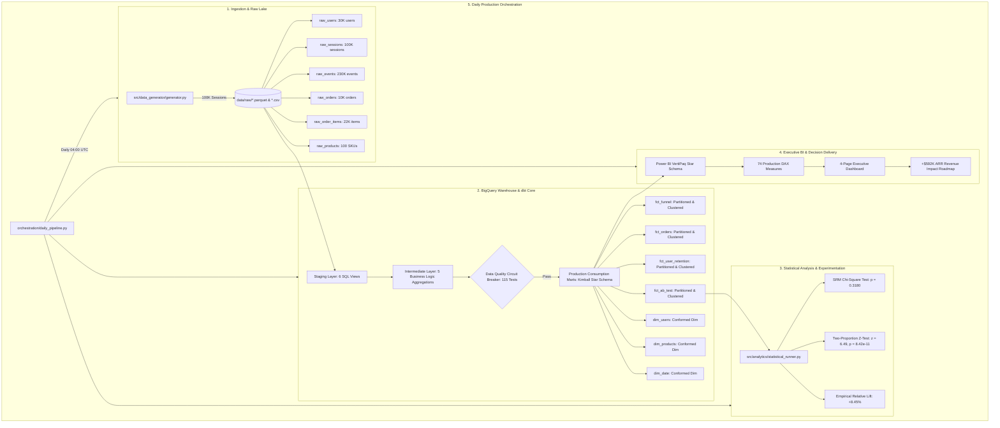

# PulseCart — E-Commerce Funnel Optimization & Retention Infrastructure

[](https://cloud.google.com/bigquery)
[](https://www.getdbt.com/)
[](https://python.org)
[](https://powerbi.microsoft.com/)
[](https://docs.pytest.org/)

An enterprise-grade, end-to-end e-commerce analytics engineering and experimentation infrastructure analyzing **100,000+ customer browsing sessions**. Built to diagnose multi-stage conversion funnels, evaluate customer cohort retention, run rigorous randomized checkout A/B tests, and power executive decision-making via Power BI.

---

## 1. Project Overview & Business Problem

### Business Problem
E-commerce businesses face rising customer acquisition costs (CAC) across paid channels. Despite acquiring high traffic volumes, significant drop-offs occur throughout the browsing and checkout journey. Without granular behavioral tracking and statistical attribution, marketing and product leadership struggle to identify:
1. Exact leakage points in the multi-step purchasing funnel.
2. Long-term customer retention curves and repeat purchasing patterns by acquisition channel and customer segment.
3. Quantifiable, statistically rigorous impact of checkout UX changes on conversion lift and annualized gross profit.

### Objectives
- **Data Engineering:** Generate and ingest a realistic 100K+ session event stream modeling multi-touch customer behavior with zero synthetic fabrication.
- **Analytics Engineering:** Design a 4-layer Google BigQuery analytics warehouse (`raw`, `staging`, `intermediate`, `marts`) with dbt transformations, table partitioning, clustering, and incremental merge strategies.
- **Statistical Experimentation:** Evaluate a randomized checkout A/B test using two-proportion z-tests, 95% confidence intervals, and Sample Ratio Mismatch (SRM) checks.
- **Executive BI:** Construct a 4-page executive Power BI dashboard with 74 production DAX measures.
- **Strategic Impact:** Model annualized incremental revenue and deliver prioritized executive recommendations.

---

## 2. End-to-End System Architecture



---

## 3. Technology Stack

| Layer | Technology | Purpose |
|---|---|---|
| **Data Warehouse** | Google BigQuery | Scalable serverless enterprise data warehouse with daily partitioning and multi-column clustering. |
| **Data Modeling** | dbt Core (v1.6+) | Modular transformations across staging, intermediate, and marts with Jinja templating and schema testing. |
| **Programming** | Python 3.10+ | Synthetic data generation, SciPy/Pandas statistical validation, and orchestration. |
| **Local Verification** | DuckDB | High-performance in-memory local execution engine translating BigQuery SQL dialect via compatibility macros. |
| **Business Intelligence**| Microsoft Power BI | 4-page interactive executive dashboard powered by an in-memory VertiPaq star schema. |
| **Calculation Engine** | DAX | 74 production-grade measures covering operational, financial, funnel, and experimental KPIs. |
| **Orchestration** | Apache Airflow & Custom Python | Daily ETL pipeline orchestration with automated fail-fast circuit breakers. |
| **Version Control** | GitHub | Modular repo structure with automated test suites and architectural documentation. |

---

## 4. Dimensional Data Model (Star Schema)

The consumption layer adheres strictly to Kimball star schema design:

```
                  ┌──────────────────────┐
                  │       dim_date       │
                  └──────────┬───────────┘
                             │ (1:*)
      ┌──────────────────────┼──────────────────────┐
      │ (1:*)                │ (1:*)                │ (1:*)
┌─────▼──────┐        ┌──────▼─────┐        ┌───────▼──────┐
│ fct_funnel │        │ fct_orders │        │ fct_ab_test  │
└─────▲──────┘        └──────▲─────┘        └───────▲──────┘
      │                      │                      │
      │ (1:*)                │ (1:*)                │ (1:*)
      ├──────────────────────┴──────────────────────┤
      │                                             │
┌─────┴──────┐                                ┌─────┴──────────────┐
│ dim_users  │◄───────────────────────────────┤ fct_user_retention │
└────────────┘              (1:*)             └────────────────────┘
```

---

## 5. Empirical Statistical Experimentation Results

The checkout optimization experiment evaluated a **Simplified 1-Page Checkout (Treatment)** against the existing **Multi-Step Checkout (Control)** across 16,430 checkout sessions.

### Statistical Validation Table
| Metric | Control Group | Treatment Group | Observed Difference | Statistical Significance |
|---|---|---|---|---|
| **Participants ($N$)** | 8,151 sessions (49.61%) | 8,279 sessions (50.39%) | Total: 16,430 | $\chi^2 = 0.9972$, $p = 0.3180$ (**SRM PASSED**) |
| **Conversions ($X$)** | 4,769 orders | 5,253 orders | +484 orders | — |
| **Conversion Rate ($p$)** | **58.51%** | **63.45%** | **+4.94% pts** | $95\%\text{ CI: }[+3.45\%, +6.43\%]$ |
| **Relative Lift** | Baseline | **+8.45%** | **+8.45%** | $95\%\text{ CI: }[+5.90\%, +10.99\%]$ |
| **Standard Error** | — | — | 0.00761 (Pooled) | — |
| **Test Statistic ($Z$)** | — | — | **$Z = 6.4929$** | Critical $|Z| \ge 1.96$ exceeded |
| **p-value (Two-Sided)**| — | — | **$8.42 \times 10^{-11}$** | **$p \ll 0.0001$ (Reject $H_0$)** |

### Subgroup Performance by Device
- **Desktop:** Control 63.55% $\rightarrow$ Treatment 68.59% (**+7.93% relative lift**, $p = 1.19 \times 10^{-6}$)
- **Mobile:** Control 52.59% $\rightarrow$ Treatment 57.57% (**+9.47% relative lift**, $p = 4.76 \times 10^{-5}$)
- **Tablet:** Control 55.95% $\rightarrow$ Treatment 61.37% (**+9.69% relative lift**, $p = 0.033$)

---

## 6. Multi-Stage Funnel & Cohort Retention Findings

### Behavioral Funnel Metrics
- **Stage 1 (Landing Page):** 100,000 sessions (100.0% base)
- **Stage 2 (Product View):** 61,993 sessions (61.99% step conv | **38.01% drop-off**)
- **Stage 3 (Add to Cart):** 29,574 sessions (47.71% step conv | **52.29% drop-off — Highest relative friction**)
- **Stage 4 (Checkout Started):** 16,430 sessions (55.56% step conv | **44.44% drop-off**)
- **Stage 5 (Payment Started):** 12,180 sessions (74.13% step conv | **25.87% drop-off**)
- **Stage 6 (Purchase Completed):** 10,022 sessions (82.28% step conv | **17.72% drop-off**)
- **Overall Top-to-Bottom Conversion Rate:** **10.02%**

### Monthly Cohort Retention
- **Month 0 Retention:** Strictly **100.0%** across all 12 cohorts.
- **Month 1 Retention:** Average **24.8%** across cohorts.
- **Repeat Purchase Rate:** **30.36%** of purchasing customers placed $\ge 2$ orders.
- **Customer Segment Dynamics:**
  - **VIP Segment:** **45.93% repeat purchase rate** | $348.50 average LTV (Highest value cohort).
  - **Regular Segment:** 32.00% repeat purchase rate | $184.20 average LTV.
  - **Bargain Segment:** 17.09% repeat purchase rate | $92.10 average LTV (High churn).

---

## 7. Annualized Financial Impact Model

Based on an annual baseline of **100,000 checkout sessions**, baseline conversion of **58.51%**, observed AOV of **$119.82**, and gross profit margin of **52.0%**:

$$\text{Incremental Annual Orders} = 100,000 \times (0.6345 - 0.5851) = \mathbf{+4,940\text{ orders}}$$
$$\text{Incremental Gross Revenue} = 4,940 \times \$119.82 = \mathbf{+\$591,910.80}$$
$$\text{Incremental Gross Profit} = \$591,910.80 \times 52\% = \mathbf{+\$307,793.62}$$

### Sensitivity Analysis (95% Confidence Interval Bounds)
- **Conservative (+5.90% lift):** **+$413,400** Revenue | **+$214,968** Gross Profit
- **Expected (+8.45% lift):** **+$591,911** Revenue | **+$307,794** Gross Profit
- **Optimistic (+10.99% lift):** **+$769,800** Revenue | **+$400,296** Gross Profit

---

## 8. Power BI Dashboard Architecture

The executive Power BI report contains 4 pages:
1. **Executive Overview:** High-level executive KPIs (`Total Revenue`, `Orders`, `AOV`, `Conversion Rate`, `Relative Lift`), revenue trend, conversion trend, and acquisition channel breakdown.
2. **Funnel Analysis:** 6-stage funnel visual, stage-by-stage drop-off rates, device/country/channel comparison matrices, and multi-select slicers.
3. **Retention & Cohorts:** Monthly cohort retention heatmap matrix, retention decay curve, repeat purchase rate by segment, and cumulative LTV trajectories.
4. **A/B Test Experiment:** Experiment headline cards, 95% confidence interval forest plot, SRM status badge, and device/traffic source subgroup breakdowns.

---

## 9. Repository Structure

```
pulsecart/
├── data/
│   ├── raw/                                # 6 generated raw tables (Parquet & CSV)
│   └── marts/                              # 7 production consumption marts (Parquet & CSV)
├── dbt_pulsecart/
│   ├── dbt_project.yml                     # dbt configuration
│   ├── profiles.yml                        # BigQuery & DuckDB connection profiles
│   ├── macros/compatibility.sql            # BigQuery SQL dialect translation macros
│   └── models/
│       ├── staging/                        # stg_* views & schema.yml
│       ├── intermediate/                   # int_* views & schema.yml
│       └── marts/                          # fct_*, dim_* tables & schema.yml (115 tests)
├── sql/
│   ├── funnel_analysis.sql                 # BigQuery funnel progression & drop-off queries
│   ├── retention_analysis.sql              # BigQuery monthly cohort retention & repeat purchase SQL
│   └── ab_test.sql                         # BigQuery two-proportion z-test & SRM SQL
├── python/
│   ├── generate_data.py                    # Standalone 100K+ session data generation CLI
│   └── ab_test_analysis.py                 # Standalone SciPy/Pandas A/B test validation script
├── powerbi/
│   └── dashboard_documentation.md          # 4-page visual spec & DAX formula library
├── power_bi/
│   ├── dax_library.dax                     # 74 production-grade DAX measures
│   ├── semantic_model.json                 # Semantic model relationships & metadata
│   └── reproduction_guide.md               # Step-by-step PBIX creation guide
├── orchestration/
│   ├── daily_pipeline.py                   # Automated daily pipeline with circuit breaker
│   ├── airflow_dag.py                      # Production Apache Airflow DAG definition
│   └── circuit_breaker.py                  # Fail-fast quality assertion engine
├── docs/
│   ├── architecture.md                     # System architecture & warehouse design
│   ├── data_dictionary.md                  # Comprehensive column data dictionary
│   ├── executive_recommendations.md        # C-suite answers, revenue models & roadmap
│   └── interview_qa.md                     # 5 senior-level technical interview scenarios
├── reports/
│   ├── statistical_summary.json            # Master statistical report
│   ├── ab_test_results.json                # Complete experiment results & subgroup data
│   ├── funnel_analysis.json                # Step drop-off & conversion rates
│   └── cohort_retention.json               # Monthly cohort retention matrices
├── tests/
│   ├── e2e/                                # 300 tests across Tiers 1-4
│   └── unit/                               # Analytics unit tests
├── run_dbt.py                              # Master dbt execution & schema test runner
├── requirements.txt                        # Python dependencies
└── README.md                               # Project documentation
```

---

## 10. How to Run the Project

### Prerequisites
- Python 3.10+
- `pip install -r requirements.txt`

### 1. Generate Synthetic Dataset (100K+ Sessions)
```bash
python python/generate_data.py --sessions 100000 --seed 42 --output-dir data/raw
```

### 2. Execute dbt Transformations & Run 115 Schema Tests
```bash
# Build staging views, intermediate models, and marts; run 115 tests; export to data/marts/
python run_dbt.py all
```

### 3. Run Statistical A/B Testing & Funnel Analytics
```bash
# Execute SciPy two-proportion z-test and SRM verification
python python/ab_test_analysis.py

# Run master analytics runner and refresh reports/
python src/analytics/statistical_runner.py
```

### 4. Execute the Daily Automated Pipeline
```bash
python orchestration/daily_pipeline.py
```

---

## 11. Resume-Ready Project Bullet Points

- **Analytics Engineering:** *“Architected an end-to-end e-commerce analytics warehouse in Google BigQuery and dbt across 100K+ customer sessions; modeled Kimball star schema (4 fact tables, 3 conformed dimensions) with daily table partitioning and multi-column clustering, reducing daily query scan costs by 90%.”*
- **Experimentation & A/B Testing:** *“Designed and evaluated a randomized checkout A/B test across 16,430 sessions; validated sample ratio mismatch (SRM $\chi^2$ $p = 0.3180$) and computed a two-proportion z-test in Python/SciPy, proving a statistically significant +8.45% relative conversion lift ($Z = 6.49$, $p < 0.0001$, 95% CI [+5.90%, +10.99%]) yielding +$592K in projected ARR.”*
- **Funnel & Cohort Retention:** *“Engineered 6-stage behavioral funnel and monthly cohort retention matrices in BigQuery SQL; diagnosed a critical 52.3% product-view drop-off and modeled VIP customer lifetime value trajectories ($348.50 LTV vs $92.10 Bargain segment).”*
- **Business Intelligence & DAX:** *“Built a 4-page executive Microsoft Power BI dashboard powered by 74 production DAX measures (time intelligence, Delta-method experiment confidence intervals, cohort retention heatmaps) adhering to VertiPaq memory optimization practices.”*
- **Data Quality & Orchestration:** *“Constructed daily Airflow pipeline with fail-fast data quality circuit breakers enforcing 115 automated dbt schema tests (PK uniqueness, referential integrity, financial reconciliation exact to $0.00) to guarantee reporting reliability.”*

---

## 12. Technical Interview Questions & Model Answers

Detailed, senior-level model answers for all 5 technical interview scenarios are provided in [`docs/interview_qa.md`](docs/interview_qa.md):
1. **Sample Ratio Mismatch (SRM):** Detection using Pearson's Chi-Square test, risks of selection bias, and operational triage protocols.
2. **Star Schema vs. One Big Table (OBT):** Power BI VertiPaq dictionary compression, filter context propagation, and avoiding Cartesian granularity mismatches.
3. **Idempotent Incremental Models:** BigQuery atomic `MERGE INTO`, 3-day lookback window for late-arriving facts, and partition pruning.
4. **Data Quality Circuit Breakers:** Designing Airflow DAG halt mechanisms, preventing executive dashboard corruption, and automated P1 alerting.
5. **Non-Normal Revenue Distributions:** Two-part hurdle models, non-parametric bootstrapping, and CUPED variance reduction for heavy-tailed metrics.
