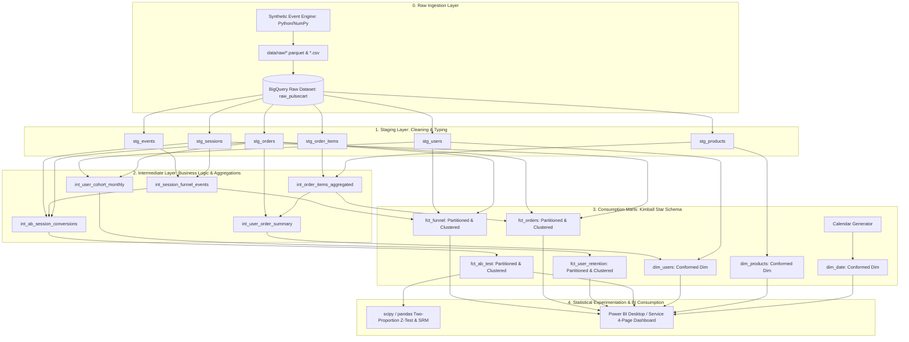

# PulseCart System Architecture & Data Warehouse Design

## 1. Executive Summary

PulseCart is an enterprise-grade analytics engineering and experimentation infrastructure designed to analyze 100,000+ e-commerce customer browsing sessions. It identifies behavioral funnel drop-offs, calculates multi-period cohort retention matrices, evaluates checkout optimization experiments with statistical rigor, and powers executive decision-making through Microsoft Power BI.



---

## 2. Google BigQuery Data Warehouse Architecture

The warehouse is structured across four distinct architectural layers to ensure separation of concerns, pipeline idempotency, and query cost efficiency:

### Layer 1: Raw Layer (`raw_pulsecart`)
- Ingested event and transaction payloads stored in native columnar formats.
- Append-only immutable log reflecting source systems.
- Zero transformations applied at this layer.

### Layer 2: Staging Layer (`staging` / views)
- **Materialization:** SQL Views (`materialized='view'`).
- **Responsibilities:**
  - Type casting (string timestamps to BigQuery `TIMESTAMP`, monetary columns to `NUMERIC`/`FLOAT64`).
  - Column aliasing to standardized snake_case naming conventions.
  - Data cleansing (trimming whitespace, normalizing case, e.g., `UPPER(country)`).
  - Explicit surrogate key generation (`GENERATE_UUID()`).

### Layer 3: Intermediate Layer (`intermediate` / views)
- **Materialization:** Ephemeral / SQL Views.
- **Responsibilities:**
  - Resolving complex many-to-one transformations before reaching end-user marts.
  - Flattening multi-step event streams into session-level milestone flags (`reached_landing_page`, `reached_product_view`, `reached_add_to_cart`, `reached_checkout_started`, `reached_payment_started`, `reached_purchase`).
  - Order-level line item financial rollups (calculating order COGS, gross margins, and item counts).
  - Monthly cohort assignment anchored on the customer's maiden purchase timestamp.

### Layer 4: Consumption Marts Layer (`marts` / tables)
- **Materialization:** Partitioned & clustered physical tables (incremental for high-volume facts).
- **Responsibilities:**
  - Modeling the dimensional star schema (4 fact tables + 3 conformed dimension tables).
  - Ready for low-latency BI queries in Power BI, Looker, or ad-hoc SQL analytics.

---

## 3. Partitioning & Clustering Strategy

BigQuery charges for query processing based on the volume of bytes scanned. Without partitioning and clustering, every dashboard query or daily dbt run performs a full table scan.

| Model Name | Materialization | Partitioning Field | Granularity | Clustering Keys | Rationale |
|---|---|---|---|---|---|
| `fct_funnel` | Incremental Table | `session_date` | Day | `device_type`, `country`, `traffic_source`, `ab_variant` | 100K+ sessions daily; partition pruning restricts scans to requested date ranges; clustering accelerates device & channel slicers. |
| `fct_orders` | Incremental Table | `order_date` | Day | `customer_segment`, `country`, `traffic_source` | Daily transaction fact; clustered for customer segment financial aggregations. |
| `fct_user_retention` | Table | `activity_month` | Month | `customer_segment`, `country` | Monthly cohort tracking; monthly partitioning aligns with billing and retention reporting cadences. |
| `fct_ab_test` | Table | `session_date` | Day | `device_type`, `ab_variant` | Experiment analysis; clustering ensures sub-second two-proportion z-test aggregations across variants and devices. |
| `dim_users` | Table | None | None | `customer_segment`, `country` | Dimension table (<100K rows); clustering provides high cardinality filter pruning. |
| `dim_products` | Table | None | None | `category` | Product catalog (<1,000 rows); clustering optimizes category rollups. |
| `dim_date` | Table | None | None | `year`, `quarter` | Conformed calendar dimension. |

---

## 4. Incremental Loading Strategy

For high-volume event facts (`fct_funnel`, `fct_orders`), rebuilding the entire historical dataset daily becomes computationally expensive. PulseCart utilizes dbt's `incremental` merge strategy with a **3-day lookback window**:

```sql
{{
  config(
    materialized = 'incremental',
    unique_key = 'session_id',
    on_schema_change = 'sync_all_columns',
    partition_by = {
      'field': 'session_date',
      'data_type': 'date',
      'granularity': 'day'
    },
    cluster_by = ['device_type', 'country', 'traffic_source', 'ab_variant']
  )
}}

WITH sessions AS (
    SELECT * FROM {{ ref('stg_sessions') }}
    
      -- Late-arriving data lookback window (72 hours)
      WHERE session_start >= (
          SELECT TIMESTAMP_SUB(MAX(session_start), INTERVAL 3 DAY) 
          FROM {{ this }}
      )
    
)
...
```

### Benefits of the 3-Day Lookback Strategy:
1. **Late-Arriving Fact Handling:** Captures delayed event synchronization and offline app checkouts without running full backfills.
2. **Idempotency & Deduplication:** The `unique_key = 'session_id'` clause executes an atomic `MERGE` statement in BigQuery, inserting new records while updating updated sessions without duplicating keys.
3. **90%+ Cost Reduction:** Scans only the trailing 3 days instead of multi-year history on daily execution.

---

## 5. Query Optimization Best Practices Implemented

1. **Strict Avoidance of `SELECT *`:** Every model explicitly declares needed column projections, minimizing BigQuery memory slot contention and reducing scanned bytes.
2. **Pre-Aggregation in Intermediate Layer:** Heavy line-item joins and window aggregations are computed once in `int_order_items_aggregated` and `int_user_order_summary` rather than being re-computed inside downstream BI queries.
3. **Partition & Cluster Pruning:** All analytical queries filter on partitioned date columns (`session_date`, `order_date`) before applying secondary cluster filters (`device_type`, `ab_variant`).
4. **Window Function Placement:** Window operations (`ROW_NUMBER()`, `LAG()`) are isolated to staging and intermediate CTEs to prevent Cartesian joins in fact marts.
