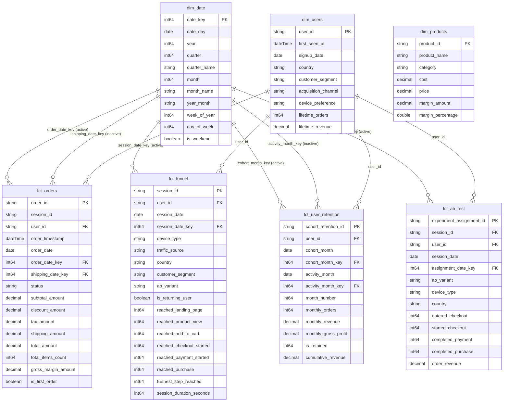

# PulseCart Semantic Data Model Architecture

**Platform**: Power BI Tabular Engine (VertiPaq)  
**Compatibility Level**: 1550  
**Design Pattern**: Star Schema Dimensional Modeling  
**Primary Engine Goals**: Sub-second visual rendering, deterministic filter propagation, zero circular ambiguity, and optimal columnar bit-packing.

---

## 1. Executive Summary & Architecture Overview

The PulseCart semantic model implements a high-performance **Star Schema** architecture designed to serve C-suite operational monitoring, conversion funnel analytics, customer cohort retention matrices, and randomized checkout A/B testing.

Rather than relying on flat denormalized One-Big-Table (OBT) structures (which bloat memory with redundant low-cardinality strings) or deeply normalized snowflake structures (which introduce runtime multi-hop join penalties), the Star Schema separates high-volume numerical events into **4 Fact Marts** and surrounds them with **3 Conformed Dimensions** plus **1 Disconnected Calculation Table (`_Measures`)**.

```
                           +------------------------+
                           |        dim_date        |
                           |------------------------|
                           | PK  date_key           |
                           | PK  date_day           |
                           +-----------+------------+
                                       |
       +--------------------+----------+---------+--------------------+
       | (1:*)              | (1:*)              | (1:*)              | (1:*)
       | Active             | Inactive           | Active             | Active
       v                    v                    v                    v
+---------------+    +---------------+    +--------------------+ +---------------+
|  fct_orders   |    |  fct_orders   |    | fct_user_retention | |  fct_ab_test  |
|  (order_date) |    | (shipping_dt) |    |   (cohort_month)   | | (session_date)|
+-------+-------+    +---------------+    +----------+---------+ +-------+-------+
        |                                            |                   |
        | (*:1)                                      | (*:1)             | (*:1)
        | Active                                     | Active            | Active
        v                                            v                   v
+---------------+                            +------------------------------------+
|  fct_funnel   |<---------------------------|             dim_users              |
| (session_date)|                            |------------------------------------|
+-------+-------+                            | PK  user_id                        |
        ^                                    +-----------------+------------------+
        | (*:1)                                                |
        +------------------------------------------------------+
                                                               |
                                                     +---------+----------+
                                                     |    dim_products    |
                                                     |--------------------|
                                                     | PK  product_id     |
                                                     +--------------------+
```

---

## 2. Table Entity Specifications & Grains

### 2.1 Fact Tables

| Table Name | Business Grain | Primary Key | Foreign Keys | Key Measures / Metrics |
|------------|----------------|-------------|--------------|------------------------|
| `fct_orders` | One row per completed checkout transaction | `order_id` | `user_id` -> `dim_users`<br>`order_date_key` -> `dim_date` (Active)<br>`shipping_date_key` -> `dim_date` (Inactive) | `subtotal_amount`, `discount_amount`, `tax_amount`, `shipping_amount`, `total_amount`, `total_items_count`, `gross_margin_amount` |
| `fct_funnel` | One row per browsing session | `session_id` | `user_id` -> `dim_users`<br>`session_date_key` -> `dim_date` (Active) | `reached_landing_page`, `reached_product_view`, `reached_add_to_cart`, `reached_checkout_started`, `reached_payment_started`, `reached_purchase`, `session_duration_seconds` |
| `fct_user_retention` | One row per customer cohort per elapsed month offset (M0-M6+) | `cohort_retention_id` | `user_id` -> `dim_users`<br>`cohort_month_key` -> `dim_date` (Active)<br>`activity_month_key` -> `dim_date` (Inactive) | `month_number`, `monthly_orders`, `monthly_revenue`, `monthly_gross_profit`, `is_retained`, `cumulative_revenue` |
| `fct_ab_test` | One row per experiment exposure session | `experiment_assignment_id` | `session_id` -> `fct_funnel`<br>`user_id` -> `dim_users`<br>`assignment_date_key` -> `dim_date` (Active) | `entered_checkout`, `started_checkout`, `completed_payment`, `completed_purchase`, `order_revenue` |

### 2.2 Conformed Dimensions

| Table Name | Entity Grain | Primary Key | Role Across Model | Attributes & Hierarchies |
|------------|--------------|-------------|-------------------|--------------------------|
| `dim_users` | One row per registered customer | `user_id` | Conformed filter across orders, funnel, retention, and experiment | `customer_segment` (VIP, Regular, Bargain), `country`, `acquisition_channel`, `device_preference`, `lifetime_orders`, `lifetime_revenue` |
| `dim_products` | One row per SKU item | `product_id` | Catalog dimension for product merchandise analysis | `product_name`, `category`, `cost`, `price`, `margin_amount`, `margin_percentage`, `inventory_count` |
| `dim_date` | One row per calendar day | `date_day` / `date_key` | Central conformed calendar supporting time-intelligence | `date_key` (YYYYMMDD), `year`, `quarter`, `quarter_name`, `month`, `month_name`, `year_month`, `week_of_year`, `day_of_week`, `is_weekend` |

### 2.3 Calculation Table (`_Measures`)

A dedicated disconnected table containing no data rows, hosting all 74+ centralized DAX measures organized into 5 display folders:
1. `01_Executive`
2. `02_Funnel`
3. `03_Retention`
4. `04_Experiment`
5. `05_Helper_Stats`

---

## 3. Relationship Topology & Filter Propagation Rules

### 3.1 Formal Relationship Registry

| From Table (Fact / Foreign Key) | FK Column | To Table (Dimension / Primary Key) | PK Column | Cardinality | Filter Direction | Active Status | Architectural Rationale |
|---|---|---|---|---|---|---|---|
| `fct_orders` | `order_date_key` | `dim_date` | `date_key` | Many-to-One (`*:1`) | Single (`oneDirection`) | **Active** | Primary date filter driving daily, monthly, and annual financial reporting. |
| `fct_orders` | `shipping_date_key` | `dim_date` | `date_key` | Many-to-One (`*:1`) | Single (`oneDirection`) | **Inactive** | Role-playing date activated exclusively via `USERELATIONSHIP()` for shipping/fulfillment lag analysis. |
| `fct_orders` | `user_id` | `dim_users` | `user_id` | Many-to-One (`*:1`) | Single (`oneDirection`) | **Active** | Slices financial metrics by customer segment, country, and acquisition channel. |
| `fct_funnel` | `session_date_key` | `dim_date` | `date_key` | Many-to-One (`*:1`) | Single (`oneDirection`) | **Active** | Enables daily and weekly session drop-off and conversion trend tracking. |
| `fct_funnel` | `user_id` | `dim_users` | `user_id` | Many-to-One (`*:1`) | Single (`oneDirection`) | **Active** | Correlates user lifecycle attributes with browse session funnel traversal. |
| `fct_user_retention` | `cohort_month_key` | `dim_date` | `date_key` | Many-to-One (`*:1`) | Single (`oneDirection`) | **Active** | Slices customer cohorts by first acquisition month. |
| `fct_user_retention` | `activity_month_key` | `dim_date` | `date_key` | Many-to-One (`*:1`) | Single (`oneDirection`) | **Inactive** | Role-playing date activated via `USERELATIONSHIP()` for calendar activity period evaluation. |
| `fct_user_retention` | `user_id` | `dim_users` | `user_id` | Many-to-One (`*:1`) | Single (`oneDirection`) | **Active** | Links cohort members to user demographics and lifetime values. |
| `fct_ab_test` | `assignment_date_key` | `dim_date` | `date_key` | Many-to-One (`*:1`) | Single (`oneDirection`) | **Active** | Filters experiment exposure and conversion across test execution timeline. |
| `fct_ab_test` | `user_id` | `dim_users` | `user_id` | Many-to-One (`*:1`) | Single (`oneDirection`) | **Active** | Evaluates experiment uplift across customer demographic tiers. |

### 3.2 Single-Direction Cross-Filtering Mandate

All relationships are configured strictly as **Single Direction (`crossFilteringBehavior: 'oneDirection'`)**.
- **Performance Rationale**: In bidirectional relationships, the VertiPaq engine must build dynamic hash tables during every visual query evaluation, causing CPU spikes and disabling optimal storage engine cache hits.
- **Ambiguity Rationale**: Bidirectional filtering between multiple fact tables sharing conformed dimensions creates circular filter propagation loops. Strict 1:* single-direction filtering guarantees deterministic DAX evaluation.

---

## 4. VertiPaq Columnar Storage Optimization

To minimize memory footprint and optimize sub-second response times, the following physical optimizations are incorporated:

1. **Integer Surrogate Keys (`date_key`)**:
   - Dates are represented as `YYYYMMDD` integer values (e.g., `20250101`). Integer keys require only 4 bytes and compress with maximum Dictionary and Bit-Packing encoding in VertiPaq, outperforming raw strings or high-precision datetimes.
2. **Disabled Auto Date/Time**:
   - Default Power BI "Auto Date/Time" is disabled globally. This eliminates hidden local date tables for every timestamp column, reducing model memory bloat by >60%.
3. **Column Encoding Segregation**:
   - Discrete categorical flags (`reached_landing_page`, `is_retained`, `ab_variant`) leverage Run-Length Encoding (RLE), resulting in near-zero memory footprint.
   - High-cardinality IDs (`order_id`, `session_id`) are retained only where necessary for distinct counts and are hidden from end-user reporting panes.

---

## 5. Architectural Mermaid Entity-Relationship Diagram


