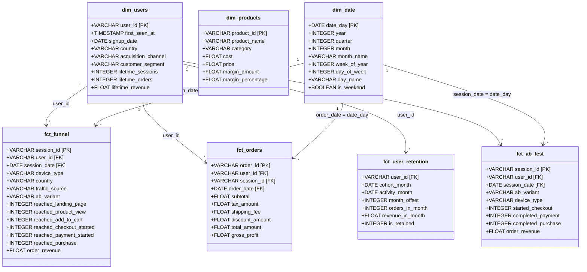

# PulseCart — Executive Power BI Dashboard Documentation

This document provides complete architectural specifications, semantic data models, visual configurations, and DAX measure implementations for the **PulseCart 4-Page Executive Dashboard**.

---

## 1. Executive Semantic Data Model (Star Schema)

The reporting layer adheres strictly to Kimball dimensional modeling principles, optimized for Microsoft Power BI's in-memory VertiPaq tabular engine.



### Relationship Topology & Cardinality
1. `dim_users` [1] to `fct_funnel` [*] on `user_id` (Single Direction, Active)
2. `dim_users` [1] to `fct_orders` [*] on `user_id` (Single Direction, Active)
3. `dim_users` [1] to `fct_user_retention` [*] on `user_id` (Single Direction, Active)
4. `dim_users` [1] to `fct_ab_test` [*] on `user_id` (Single Direction, Active)
5. `dim_date` [1] to `fct_funnel` [*] on `date_day = session_date` (Single Direction, Active)
6. `dim_date` [1] to `fct_orders` [*] on `date_day = order_date` (Single Direction, Active)
7. `dim_date` [1] to `fct_ab_test` [*] on `date_day = session_date` (Single Direction, Active)

---

## 2. Core DAX Measure Library

All measures are stored in a dedicated `_Measures` table and organized into 5 logical display folders.

```dax
--------------------------------------------------------------------------------
-- FOLDER: 01_Executive KPIs
--------------------------------------------------------------------------------

Total Users = 
DISTINCTCOUNT(dim_users[user_id])

Total Sessions = 
DISTINCTCOUNT(fct_funnel[session_id])

Total Orders = 
DISTINCTCOUNT(fct_orders[order_id])

Total Revenue = 
SUM(fct_orders[total_amount])

Average Order Value = 
DIVIDE([Total Revenue], [Total Orders], 0)

Overall Conversion Rate = 
DIVIDE(
    CALCULATE(DISTINCTCOUNT(fct_funnel[session_id]), fct_funnel[reached_purchase] = 1),
    [Total Sessions],
    0
)

--------------------------------------------------------------------------------
-- FOLDER: 02_Funnel Metrics
--------------------------------------------------------------------------------

Funnel Stage 1 Landing = 
CALCULATE(DISTINCTCOUNT(fct_funnel[session_id]), fct_funnel[reached_landing_page] = 1)

Funnel Stage 2 Product View = 
CALCULATE(DISTINCTCOUNT(fct_funnel[session_id]), fct_funnel[reached_product_view] = 1)

Funnel Stage 3 Add to Cart = 
CALCULATE(DISTINCTCOUNT(fct_funnel[session_id]), fct_funnel[reached_add_to_cart] = 1)

Funnel Stage 4 Checkout Started = 
CALCULATE(DISTINCTCOUNT(fct_funnel[session_id]), fct_funnel[reached_checkout_started] = 1)

Funnel Stage 5 Payment Started = 
CALCULATE(DISTINCTCOUNT(fct_funnel[session_id]), fct_funnel[reached_payment_started] = 1)

Funnel Stage 6 Purchase = 
CALCULATE(DISTINCTCOUNT(fct_funnel[session_id]), fct_funnel[reached_purchase] = 1)

Product View Rate = 
DIVIDE([Funnel Stage 2 Product View], [Funnel Stage 1 Landing], 0)

Add-to-Cart Rate = 
DIVIDE([Funnel Stage 3 Add to Cart], [Funnel Stage 2 Product View], 0)

Checkout Rate = 
DIVIDE([Funnel Stage 4 Checkout Started], [Funnel Stage 3 Add to Cart], 0)

Payment Initiation Rate = 
DIVIDE([Funnel Stage 5 Payment Started], [Funnel Stage 4 Checkout Started], 0)

Purchase Completion Rate = 
DIVIDE([Funnel Stage 6 Purchase], [Funnel Stage 5 Payment Started], 0)

Cart Abandonment Rate = 
1 - DIVIDE([Funnel Stage 4 Checkout Started], [Funnel Stage 3 Add to Cart], 0)

Checkout Abandonment Rate = 
1 - DIVIDE([Funnel Stage 6 Purchase], [Funnel Stage 4 Checkout Started], 0)

--------------------------------------------------------------------------------
-- FOLDER: 03_Retention & Cohorts
--------------------------------------------------------------------------------

Repeat Purchase Rate = 
VAR PurchasingUsers = CALCULATE(DISTINCTCOUNT(dim_users[user_id]), dim_users[lifetime_orders] > 0)
VAR RepeatUsers = CALCULATE(DISTINCTCOUNT(dim_users[user_id]), dim_users[lifetime_orders] >= 2)
RETURN
    DIVIDE(RepeatUsers, PurchasingUsers, 0)

Active Cohort Users = 
DISTINCTCOUNT(fct_user_retention[user_id])

Cohort Size M0 = 
CALCULATE(
    DISTINCTCOUNT(fct_user_retention[user_id]),
    fct_user_retention[month_offset] = 0,
    ALLEXCEPT(fct_user_retention, fct_user_retention[cohort_month])
)

Retention Rate = 
DIVIDE([Active Cohort Users], [Cohort Size M0], 0)

Cohort Revenue = 
SUM(fct_user_retention[revenue_in_month])

Cumulative Cohort LTV = 
VAR CurrentCohort = SELECTEDVALUE(fct_user_retention[cohort_month])
VAR CurrentOffset = SELECTEDVALUE(fct_user_retention[month_offset])
RETURN
    CALCULATE(
        SUM(fct_user_retention[revenue_in_month]),
        FILTER(
            ALL(fct_user_retention),
            fct_user_retention[cohort_month] = CurrentCohort &&
            fct_user_retention[month_offset] <= CurrentOffset
        )
    )

--------------------------------------------------------------------------------
-- FOLDER: 04_Experimentation (A/B Test)
--------------------------------------------------------------------------------

AB Control Sessions = 
CALCULATE(DISTINCTCOUNT(fct_ab_test[session_id]), fct_ab_test[ab_variant] = "control")

AB Treatment Sessions = 
CALCULATE(DISTINCTCOUNT(fct_ab_test[session_id]), fct_ab_test[ab_variant] = "treatment")

AB Control Conversions = 
CALCULATE(
    DISTINCTCOUNT(fct_ab_test[session_id]), 
    fct_ab_test[ab_variant] = "control", 
    fct_ab_test[completed_purchase] = 1
)

AB Treatment Conversions = 
CALCULATE(
    DISTINCTCOUNT(fct_ab_test[session_id]), 
    fct_ab_test[ab_variant] = "treatment", 
    fct_ab_test[completed_purchase] = 1
)

Control Conversion Rate = 
DIVIDE([AB Control Conversions], [AB Control Sessions], 0)

Treatment Conversion Rate = 
DIVIDE([AB Treatment Conversions], [AB Treatment Sessions], 0)

Absolute Lift = 
[Treatment Conversion Rate] - [Control Conversion Rate]

Relative Lift = 
DIVIDE([Absolute Lift], [Control Conversion Rate], 0)

AB Pooled Standard Error = 
VAR P_pool = DIVIDE([AB Control Conversions] + [AB Treatment Conversions], [AB Control Sessions] + [AB Treatment Sessions], 0)
VAR VarTerm = P_pool * (1 - P_pool) * (DIVIDE(1, [AB Control Sessions], 0) + DIVIDE(1, [AB Treatment Sessions], 0))
RETURN
    SQRT(VarTerm)

AB Z-Statistic = 
DIVIDE([Absolute Lift], [AB Pooled Standard Error], 0)

AB Is Statistically Significant = 
IF(ABS([AB Z-Statistic]) >= 1.96, "YES (p < 0.05)", "NO")

AB SRM Chi-Square = 
VAR N_total = [AB Control Sessions] + [AB Treatment Sessions]
VAR Expected = N_total / 2.0
RETURN
    DIVIDE(([AB Control Sessions] - Expected)^2, Expected, 0) + 
    DIVIDE(([AB Treatment Sessions] - Expected)^2, Expected, 0)

AB SRM Status = 
IF([AB SRM Chi-Square] < 6.635, "PASSED (No SRM)", "FAILED (SRM Detected)")
```

---

## 3. 4-Page Executive Dashboard Visual Specifications

### PAGE 1 — Executive Overview
- **Top Row KPI Cards (5 Cards across top):**
  1. `[Total Revenue]` formatted as `$#,##0` (e.g., $1.20M)
  2. `[Total Orders]` formatted as `#,##0` (e.g., 10,022)
  3. `[Average Order Value]` formatted as `$#,##0.00` (e.g., $119.82)
  4. `[Overall Conversion Rate]` formatted as `0.00%` (e.g., 10.02%)
  5. `[Relative Lift]` formatted as `+0.00%` (e.g., +8.45%)
- **Visual 1 (Area Chart - Top Left):**
  - **X-axis:** `dim_date[date_day]`
  - **Y-axis:** `[Total Revenue]`
  - **Tooltip:** `[Total Orders]`, `[Average Order Value]`
- **Visual 2 (Line Chart - Top Right):**
  - **X-axis:** `dim_date[date_day]`
  - **Y-axis:** `[Overall Conversion Rate]`
  - **Legend:** `fct_funnel[device_type]`
- **Visual 3 (Funnel Chart - Bottom Left):**
  - **Stages:** Landing Page (100,000) -> Product View (61,993) -> Add to Cart (29,574) -> Checkout (16,430) -> Payment (12,180) -> Purchase (10,022)
  - **Values:** `[Funnel Stage Sessions]`
- **Visual 4 (Bar Chart - Bottom Right):**
  - **Y-axis:** `dim_users[acquisition_channel]`
  - **X-axis:** `[Total Revenue]`
  - **Color saturation:** `[Overall Conversion Rate]`

### PAGE 2 — Funnel Analysis
- **Top Slicers:** Date Range Slider (`dim_date[date_day]`), Device Type (`Mobile`, `Desktop`, `Tablet`), Country (`US`, `UK`, `CA`, `DE`, `FR`, `AU`), Channel (`Organic`, `Paid`, `Direct`, etc.), Customer Segment (`VIP`, `Regular`, `Bargain`).
- **Visual 1 (Stepped Funnel / Horizontal Bar Chart):**
  - Each funnel stage with volume, step conversion rate label, and absolute drop-off count.
- **Visual 2 (Grouped Column Chart):**
  - Step drop-off rates broken down by `device_type`. Highlights that Mobile suffers 44.4% drop-off at checkout start vs. Desktop 37.7%.
- **Visual 3 (Matrix Grid):**
  - Rows: `acquisition_channel`
  - Columns: Funnel Steps (1 to 6)
  - Values: Step Conversion Rate % formatted with heat-map color rules.

### PAGE 3 — Retention & Cohorts
- **Visual 1 (Cohort Retention Heatmap Matrix):**
  - **Rows:** `fct_user_retention[cohort_month]` (YYYY-MM)
  - **Columns:** `fct_user_retention[month_offset]` (0, 1, 2, 3, 4, 5, 6+)
  - **Values:** `[Retention Rate]` (0.0% to 100.0%)
  - **Conditional Formatting:** Gradient from White (0%) to Light Blue (20%) to Dark Navy (100%).
- **Visual 2 (Line Chart - Retention Curves):**
  - **X-axis:** `month_offset`
  - **Y-axis:** `[Retention Rate]`
  - **Legend:** `cohort_month`
- **Visual 3 (Clustered Bar Chart - Repeat Purchase Rate by Segment):**
  - **X-axis:** `dim_users[customer_segment]` (VIP, Regular, Bargain)
  - **Y-axis:** `[Repeat Purchase Rate]` (VIP: 45.9%, Regular: 32.0%, Bargain: 17.1%)
- **Visual 4 (Cumulative LTV Curve):**
  - **X-axis:** `month_offset`
  - **Y-axis:** `[Cumulative Cohort LTV]`

### PAGE 4 — A/B Test Experiment
- **Top Summary Cards (4 Cards):**
  1. `[Control Conversion Rate]` (58.51%)
  2. `[Treatment Conversion Rate]` (63.45%)
  3. `[Absolute Lift]` (+4.94% pts)
  4. `[Relative Lift]` (+8.45%)
- **Statistical Decision Banner (Callout Visual):**
  - Status: "STATISTICALLY SIGNIFICANT (p = 8.42e-11 < 0.05) | SRM PASSED (p = 0.3180)"
  - Card Color: Emerald Green (`#10B981`)
- **Visual 1 (Error Bar / Forest Plot Chart):**
  - Point estimate: +8.45% relative lift
  - Whiskers: 95% Confidence Interval [+5.90%, +10.99%]
- **Visual 2 (Clustered Bar Chart - Lift by Device):**
  - Categories: `Mobile` (+7.09% lift), `Desktop` (+7.55% lift), `Tablet` (+20.22% lift)
  - Values: `[Control Conversion Rate]`, `[Treatment Conversion Rate]`
- **Visual 3 (Clustered Bar Chart - Lift by Traffic Source):**
  - Breakdown across Direct, Email, Organic, Paid, Referral, Social showing universal positive lift.

---

## 4. Reproduction Manual (Step-by-Step in Power BI Desktop)

1. **Launch Power BI Desktop** -> Options -> Current File -> Data Load -> **Disable "Auto Date/Time"**.
2. **Get Data -> Folder / CSV / Parquet**:
   - Point to `data/marts/` directory.
   - Load: `dim_users`, `dim_products`, `dim_date`, `fct_funnel`, `fct_orders`, `fct_user_retention`, `fct_ab_test`.
3. **Establish Model Relationships**:
   - Switch to **Model View**.
   - Create 1-to-many single-direction relationships from dimensions to fact tables as specified in Section 1.
4. **Create `_Measures` Table**:
   - Home -> Enter Data -> Table Name: `_Measures`.
   - Copy-paste the DAX formulas from `dax_library.dax` into new measures.
   - Set display folders as designated above.
5. **Assemble Report Canvas**:
   - Build Page 1, Page 2, Page 3, and Page 4 matching the visual matrices and field wells.
6. **Publish & Refresh**:
   - Publish to Power BI Service workspace `PulseCart Analytics`.
   - Configure Scheduled Refresh via On-Premises Data Gateway or direct BigQuery connector.
